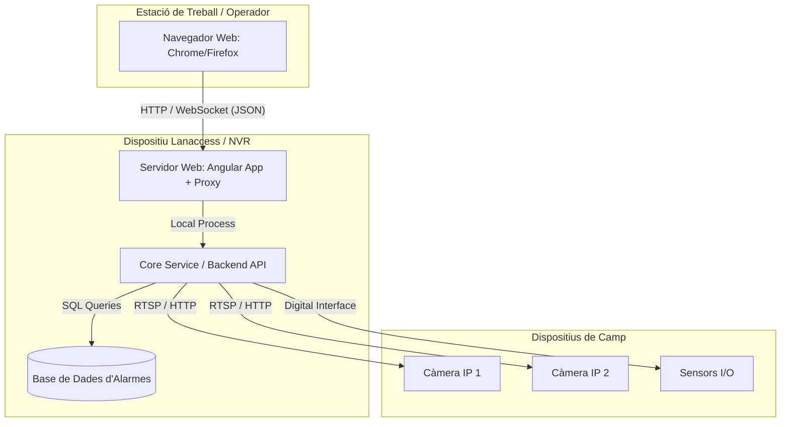
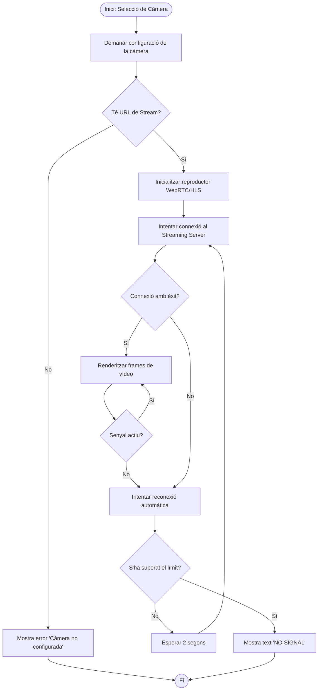
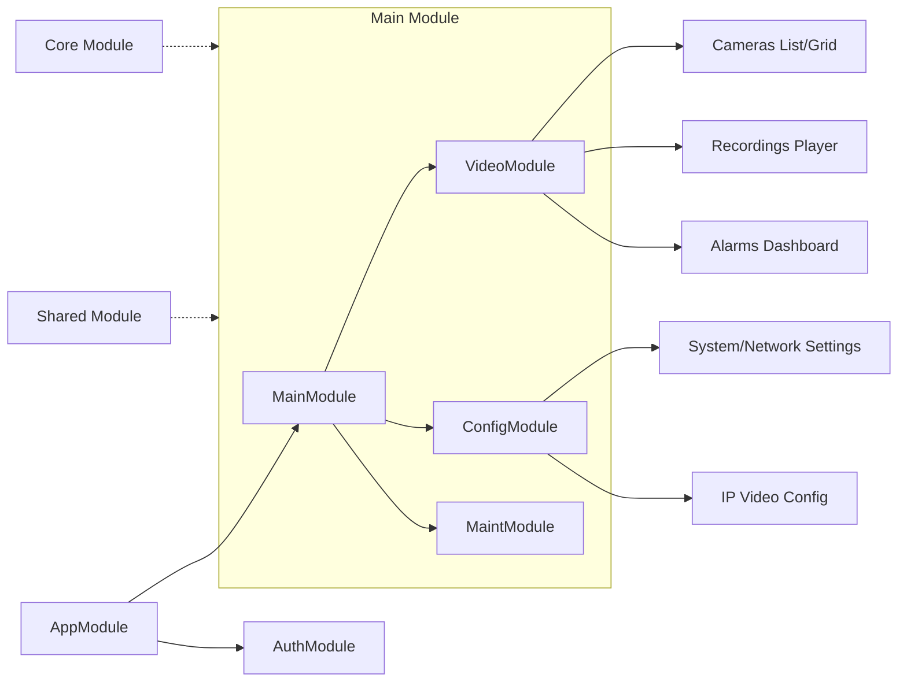

# Diagrames de Lògica i Arquitectura de Xarxa

Aquests diagrames se centren en la part més tècnica i d'enginyeria del projecte: com es desplega el sistema i com funcionen els algoritmes interns.

---

## 1. Diagrama de Desplegament (Deployment Diagram)

Mostra la distribució física dels components i els protocols de comunicació entre ells.

---

## 2. Diagrama d'Activitat: Lògica de Connexió al Vídeo

Explica el procés que segueix l'aplicació per establir una connexió de streaming i què fa si falla.

---

## 3. Arquitectura de l'Aplicació (Mòduls Angular)

Aquest diagrama ajuda a entendre l'organització interna del codi que has desenvolupat.

