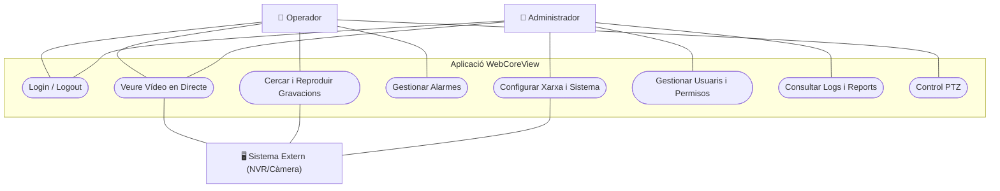
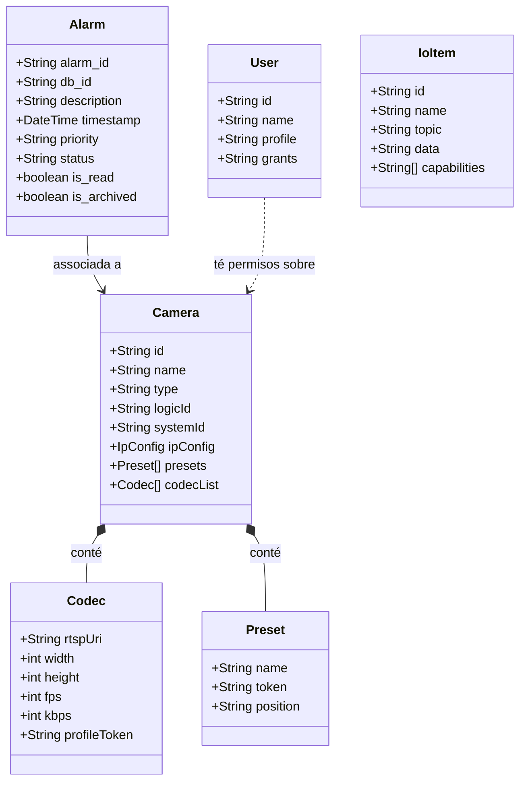
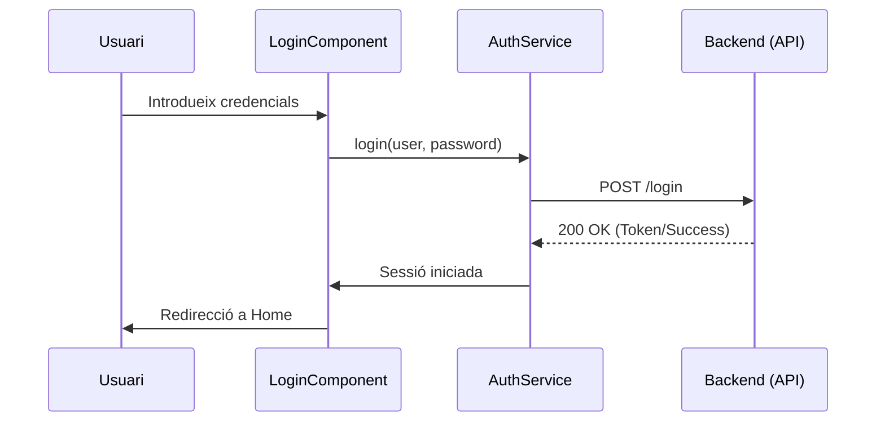
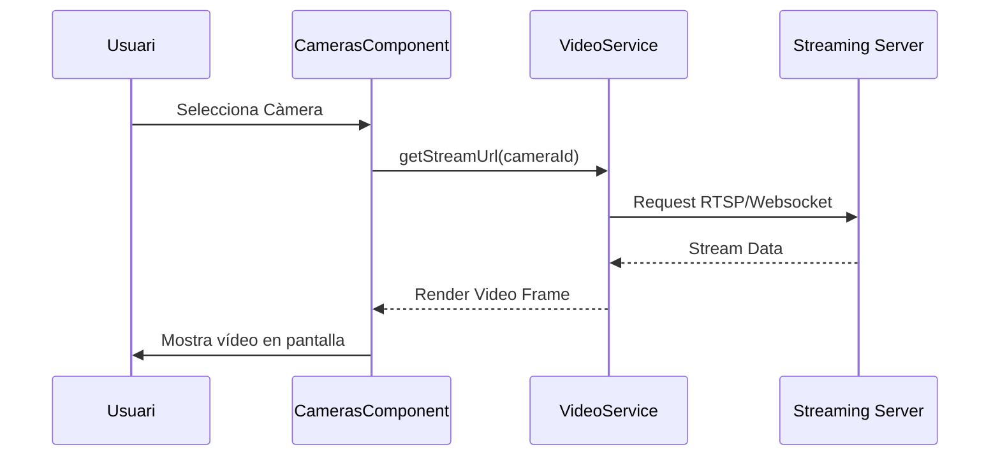
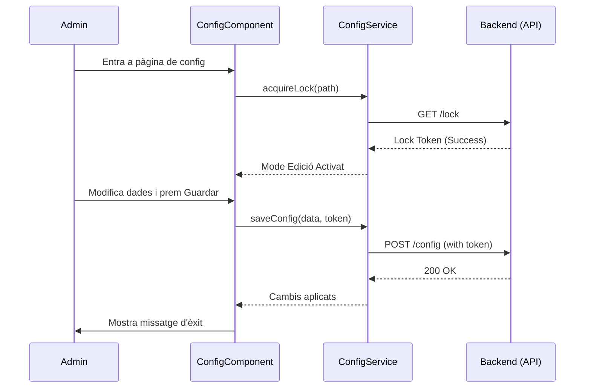
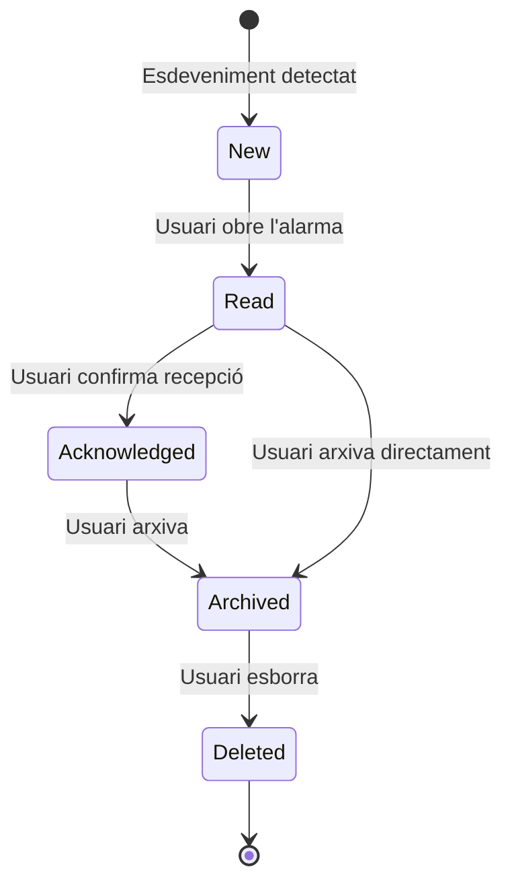
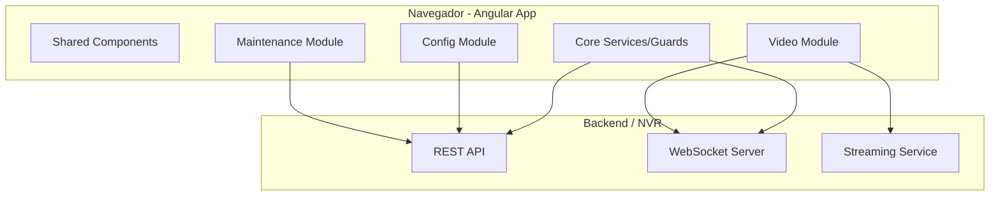

# Diagrames en Mermaid (UML) per al TFG

Aquest fitxer conté el codi **Mermaid** per a tots els diagrames proposats a la guia. Pots visualitzar aquests diagrames directament a GitHub, VS Code (amb l'extensió de Mermaid) o copiant el codi a l'editor online: [Mermaid Live Editor](https://mermaid.live/).

---

## 1. Diagrama de Casos d'Ús

---

## 2. Diagrama de Classes

---

## 3. Diagrames de Seqüència

### A. Flux de Login

### B. Visualització de Vídeo

### C. Canvi de Configuració (amb Lock)

---

## 4. Diagrama d'Estats (Alarma)

---

## 5. Diagrama de Components (Arquitectura)

