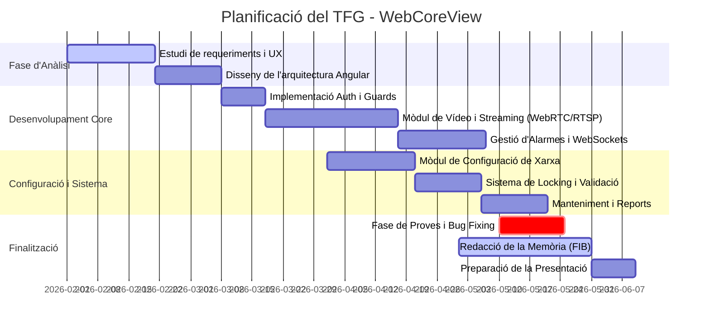
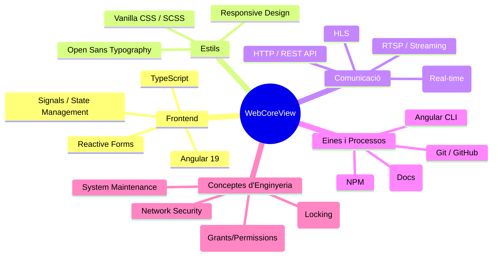
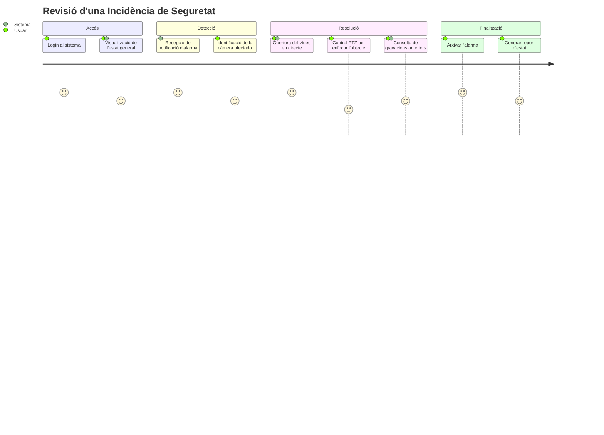

# Planificació i Stack Tecnològic (Mermaid)

Aquest fitxer conté diagrames visuals per complementar la memòria del TFG en l'apartat de gestió del projecte i arquitectura tecnològica.

---

## 1. Cronograma del Projecte (Diagrama de Gantt)

Aquest diagrama mostra les fases de desenvolupament des de l'inici fins a la presentació final. Els terminis són aproximats basats en el progrés actual del projecte.

---

## 2. Mapa Mental de Tecnologies (Stack Tecnològic)

Un resum visual de totes les tecnologies i conceptes aplicats en el projecte.

---

## 3. Flux d'Interacció de l'Usuari (User Journey)

Aquest diagrama ajuda a explicar com un usuari utilitza l'app per resoldre un problema (per exemple, revisar una alarma).

